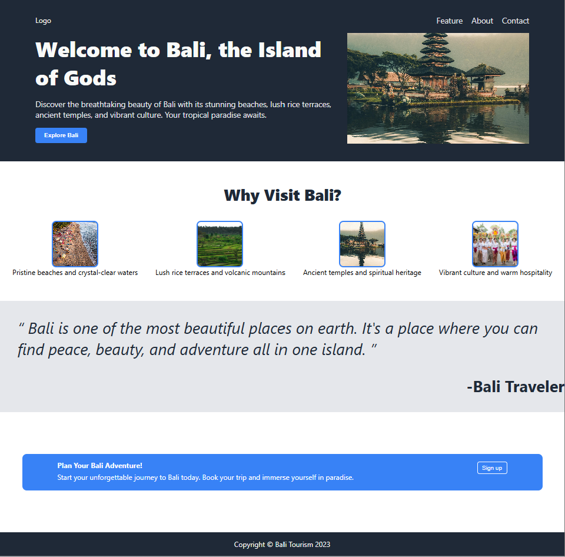

Odin Project: Landing Page

This Odin Project exercise was designed to develop proficiency with CSS Flexbox and responsive layout design. Using the provided reference site and style guidelines, I recreated the landing page structure while incorporating custom copy and imagery. The result is a mostly responsive implementation that reflects a strong foundation in HTML and CSS.

Outcome Achieved

Reference Output

Colors and font style reference

